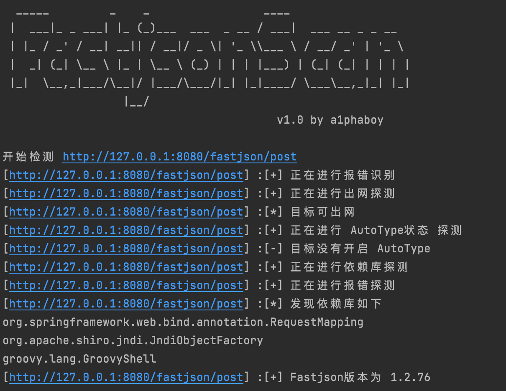
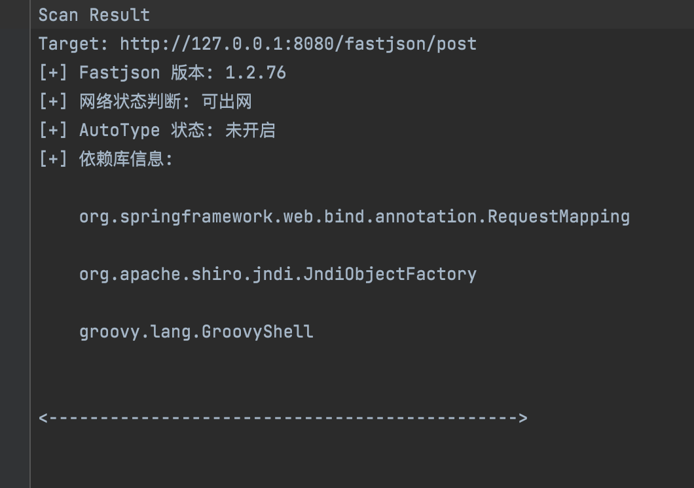

# FastjsonScan
A tool to fast detect fastjson‘s deserialize vuln

## 0x00  FastjsonScan now is public  🎉🎉🎉

### WHAT?
FastjsonExpFramework一共分为探测、利用、混淆、bypass JDK等多个模块，而FastjsonScan 是其中一部分，通过报错、请求、依赖库等探测实现多方面定位fastjson版本  

### WHY?
现有的fastjson扫描器无法满足迭代速度如此快的fastjson版本，大部分扫描器早已无人维护，已不适配高版本。我将持续优化此系列项目。

### HOW?
目前fastjsonScan支持  
☑️支持批量接口探测  
☑️1.2.83及以下的区间探测(主要分为48,68,80三大安全版本)  
☑️支持报错回显探测  
☑️DNS出网检测  
☑️支持AutoType状态检测  
☑️依赖库检测  
☑️延迟检测  

### TODO
适配内网环境下的探测  
适配webpack做自动化扫描  
完善DNS回显探测依赖库的探测  
完善在61版本以上并且不出网的检测方式  
完善其他不同json解析库的探测
完善相关依赖库检测

### 如果在使用过程中有任何问题欢迎提出issues👏

### Demo

## Usage
**FastjsonScan [-u] url [-f] urls.txt [-o] result.txt**  
-u 目标url，注意需要加上http/https  
-f 目标url文件，可以扫描多条url  
-o 结果保存文件，默认在当前文件夹下的results.txt文件  

## 0x01 Dev Notes 

### 2022-09-05 0.5 
Framework分离出scan模块

### 2022-09-05 0.4 beta
☑️重构版本探测模块，将判断fastjson,jackson,org.json,gson分离出来做识别模块  

TODO:  
利用dnslog探测依赖库  
利用模块编写  

### 2022-09-04 0.35 beta
☑️修复了48版本的探测payload,该payload在进行80版本的payload探测之后，会触发tojavaobject从而将java.net.InetAddress类加入白名单，当进行第二次版本探测时会产生误报  
☑️版本检测会优先判断AutoType是否开启，如果开启只能模糊区分48以下及以上

### 2022-09-03 0.34 beta
☑️重构了版本探测模块，由之前精确探测分成了3块（48，68，80）  
☑️重写了判断版本的逻辑  
☑️补充了80版本与83版本的探测

TODO:  
目标依赖库环境的探测  
AutoType的状态对版本探测有影响，需要做处理

### 2022-09-02 0.33 beta
☑️修改了含有jackson字段的报错检测逻辑  
☑️DNS检测新增10秒的等待时间，防止网络原因导致误报

### 2022-09-01 0.32 beta
☑️添加多条gadget，部分gadget复现不成功，根据目标的环境添加  
☑️修改了延迟探测的bug  
☑️添加了URLReader的探测链

### 2022-08-07  0.31 beta
☑️增加了几条gadgets

### 2022-08-06  0.3  beta
☑️完成了AutoType探测模块

### 2022-08-05  0.2  beta
☑️完成了探测模块的主要部分：包括报错探测，DNS探测和延迟探测

## 0x02参考
https://github.com/safe6Sec/Fastjson    
https://github.com/hosch3n/FastjsonVulns   
https://github.com/iSafeBlue/fastjson-autotype-bypass-demo  

## 0x03鸣谢
非常感谢 [blue](https://github.com/iSafeBlue) 浅蓝师傅在kcon上的精彩分享  
非常感谢 [hosch3n](https://github.com/hosch3n) 李师傅的答疑解惑

